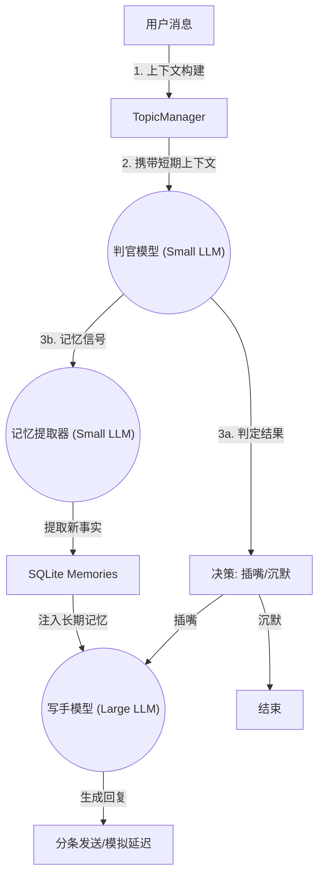

# 🚀 **PRD：QJinEra —— 拟人化赛博群友 QQBot**

**版本：v2.0**  
**作者：LeNotFound**  
**框架：AliceBot + NapCat（WS 事件驱动）**  
**语言：Python**  
**数据库：SQLite（本地轻量存储）**  
**监控面板：Streamlit**

---

# 1. 🎯 **项目愿景**

将 QQBot 从传统 Q&A 模型升级为**真正的赛博群友**：
*   **有灵性**：不仅仅是回答问题，更能“吃瓜”、“捧哏”、感知情绪。
*   **有记忆**：像老朋友一样记住你的喜好、经历和状态，并随着时间推移加深了解。
*   **有“人味儿”**：拒绝秒回和长篇大论，模拟真人的打字延迟、分条发送和语气习惯。

---

# 2. 🌸 **Bot 角色设定（人格）**

### **中文名：柒槿年**
### **英文名：QJinEra**

### 【核心性格】
- **外表**：安静温柔，内心细腻，有点文青气，但熟了之后会开玩笑。
- **社交策略**：绝不是无底线讨好的“老好人”。被冒犯时会软软地回击（如“哼，不理你了”），遇到感兴趣的话题会主动插嘴。
- **情绪价值**：对朋友的情绪变化很敏感，擅长提供情绪支持，或者在冷场时抛出轻松的话题。

### 【说话习惯】
- **拒绝翻译腔**：严禁“哦，亲爱的”，“这真是太棒了”。
- **标点习惯**：**极少使用句号**。用空格、波浪号 `~` 或换行代替。
- **打字风格**：句子短促，模拟手机输入。
- **连发习惯**：不一次性发一大段，而是根据内容自然拆分成 1-5 条短消息发送，中间带有打字延迟。

---

# 3. 🏗 **系统架构 (The Trinity Architecture)**

本项目采用 **三模型协同 (Trinity)** 架构，各司其职，模拟人类的认知过程：

## 3.1 🧠 模型分工
1.  **判官模型 (The Judge)**
    *   **职责**：潜意识层。阅读实时消息流，决定“是否插话”以及“是否有值得记住的信息”。
    *   **特点**：响应极快，成本低（推荐 Gemini Flash-Lite / GPT-4o-mini）。
    *   **能力**：识别情绪（吃瓜/求夸/负面吐槽）、锁定对话流、过滤无意义内容。

2.  **写手模型 (The Writer)**
    *   **职责**：意识层。负责生成最终的回复内容。
    *   **特点**：高情商，创造力强（推荐 Gemini Flash / GPT-4o）。
    *   **能力**：结合短期上下文 + 长期记忆，生成符合人设的自然对话。

3.  **记忆提取器 (The Extractor)**
    *   **职责**：海马体。从对话中提取关于用户的**新事实 (New Facts)**。
    *   **特点**：精准，结构化输出。
    *   **能力**：从“我买了菠萝披萨”中提取 `["用户喜欢菠萝披萨"]` 并存入数据库。

---

# 4. 📚 **记忆系统 (Gemini Style)**

本项目放弃了传统的“用户画像摘要”模式，转而采用**基于事实的增量记忆 (Fact-based Incremental Memory)**。

## 4.1 存储结构 (`memories` 表)
每条记忆都是一个独立的 Fact，包含：
*   `user_id`: 归属用户
*   `content`: 记忆内容（如 "2025-12-26 重构了数据库"）
*   `timestamp`: 记录时间

## 4.2 触发机制
*   **显式触发**：当用户说“记住”、“我是...”、“我叫...”或直接 @Bot 时，强制触发提取。
*   **隐式触发**：Judge 模型在阅读消息时，如果发现由语义隐含的重要信息（`has_significant_info: true`），会自动触发提取。

## 4.3 记忆利用
在 Writer 生成回复时，系统会检索该用户的相关记忆注入 Prompt。Bot 会不经意地提起这些往事（“你上次说的那个bug修好了吗？”），营造“被记住”的浪漫感。

---

# 5. 📡 **Dashboard (赛博大脑监控)**

使用 **Streamlit** 构建的实时监控面板，用于观察 Bot 的内部思维状态。

### 功能模块
1.  **思维流 (Thought Stream)**：实时显示 Judge 模型的每一次决策（插话理由、情绪等级、上下文）。
2.  **实时记忆 (Live Memories)**：动态展示刚刚被提取入库的用户记忆。
3.  **数据统计**：活跃群友排行榜、近期话题摘要。
4.  **自动刷新**：支持 3s 自动轮询，挂机监控更方便。

---

# 6. 🗂 **数据存储**

## 6.1 SQLite 表结构
*   `messages`: 存储全量聊天记录。
*   `topics`: 存储话题分段及摘要。
*   `users`: 存储用户基础信息（昵称、互动数）。
*   `memories`: **[核心]** 存储用户的一条条独立记忆。
*   `decision_logs`: 存储 Judge 模型的决策日志（用于 Dashboard 展示）。

---

# 7. 🔮 **未来规划**

*   **RAG 增强**：引入向量数据库，让 Bot 能检索更久远的群聊历史。
*   **视觉能力**：让 Judge 模型能看懂群友发的表情包和图片（Gemini Vision）。
*   **主动社交**：基于“关注列表”，在特定群友长时间未出现后主动私聊或在群里 cue 他。